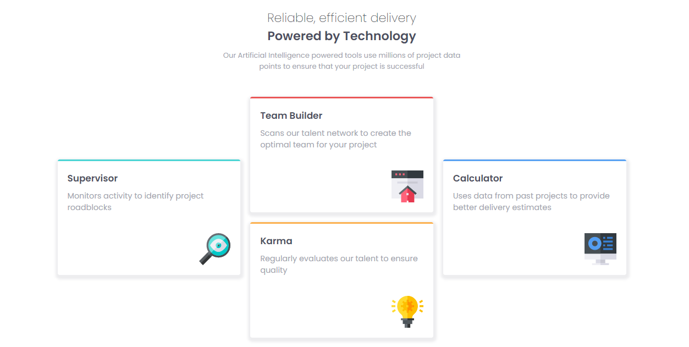

# Frontend Mentor - Four card feature section solution

This is a solution to the [Four card feature section challenge on Frontend Mentor](https://www.frontendmentor.io/challenges/four-card-feature-section-weK1eFYK). Frontend Mentor challenges help you improve your coding skills by building realistic projects.

## Table of contents

- [Overview](#overview)
  - [The challenge](#the-challenge)
  - [Screenshot](#screenshot)
  - [Links](#links)
- [My process](#my-process)
  - [Built with](#built-with)
  - [What I learned](#what-i-learned)
  - [Continued development](#continued-development)
  - [Useful resources](#useful-resources)
- [Author](#author)
- [Acknowledgments](#acknowledgments)

## Overview

### The challenge

Users should be able to:

- View the optimal layout for the site depending on their device's screen size

### Screenshot

### Links

- Solution URL: [Add solution URL here](https://your-solution-url.com)
- Live Site URL: [Add live site URL here](https://your-live-site-url.com)

## My process

### Built with

- HTML
- CSS
- Flexbox
- CSS Grid

### What I learned

This is my first time using media queries since i started html and as expected i
had to struggle, tweak a few things to get a handle on it... In the future i'll
see if i can adopt the Mobile-first development methodology..

- I got to watch a few videos on using git

## Author

- Website - [Ajobiewe Joseph](https://github.com/jossyboy2580)
- Frontend Mentor - [@jossyboy2580](https://www.frontendmentor.io/profile/jossyboy2580)
- Twitter - [@jossyboy2580](https://www.twitter.com/jossyboy2580)

## Acknowledgments

Myself for always coming back to my laptop whenever something gives me a tough time
